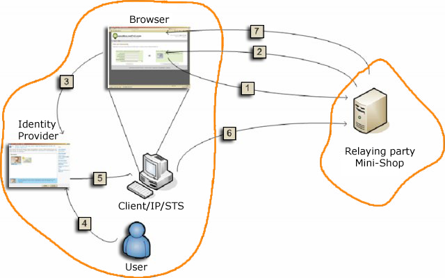

.. _infocards:

*****************************
 InformationCard Description
*****************************

Information Cards is a useful application which makes user activities
in the net easier to handle. It is gaining user awareness and is
supported by a range of sites already. The application is simple to
use, but what is happening in the background? How does InformationCard
work? What are its advantages?  General questions and particularly
administrators’ questions about InformationCard, its construction and
expiry data will be answered in the following sections.

Basic Information
=================

In order to illustrate the JInfoCard procedure, the basics must
be understood first.  The extension consists of several components
which play together in a framework, thus enabling InformationCard to
be used. Basically, the user connects over the two different protocol
types HTTP and HTTPS to a :term:`relying party <Relying Party>`. HTTPS
is the standard for encrypted transference of data between browser and
web server. Thereby some :term:`claims <Claims>` representing personal
information about the user are interchanged. The framework further
uses a PPID, which means Personal Private Identifier. PPID is unique
for each web page, an unequivocal ID. It is generated by
InformationCard’s master key and a public key. Every InformationCard
contains its own PPID for each website. WCS, which stands for Windows
Card Space (formerly InfoCard) will be referred to in the following
description.

How InformationCard Works
=========================

When a user connects to a web service with CardSpace support, an
Identity Selector will open. It manages the user’s different digital
identities and displays all available cards that may be used for
authentication. The user simply selects a card and depending on the
card type (managed or self-issued) a security token is sent back with
an SSL certificate encrypted to the site from either an IP or the
local computer.

The unique identifier based on the Personal Private Identifier (PPID)
is used to combine a card with the account. Setting managed cards
aside for a moment, here is the general flow for self-issued cards:

   How InformationCard works

1. The user connects with a browser to a relying party (RP) holding a
   desired service

   * selects a service and WCS login appears automatically, or
   * performs a direct login query via WCS where the usual U/P login exists

2. The RP sends back its policy specifying the set of claims it
   requires and accepts.

3. The browser pops up an Identity Selector presenting a list of cards
   which meet these requirements.

   The user can only select cards which satisfy the requirements of
   the RP.

4. The user selects a card

5. The Identity Selector connects to the IP/STS - in this case the
   client itself – and receives a security token.

6. The security token is sent back to the RP.  When communicating over
   a secure connection, is encrypted using the website’s SSL
   certificate.

7. The RP validates the token and grants access to the services

Interoperability of InformationCards
====================================

  "Interoperability means the ability of information and communication
  technology (ICT) systems and of the business processes they support
  to exchange data and to enable the sharing of information and
  knowledge..." [IDABC-EIF]_

On the basis of this definition three kinds of interoperability can be
distinguished:

* Organizational interoperability
* Semantic interoperability, and
* Technical interoperability

This document focuses on the technical aspects of interoperability
defined by the EICTA as "the ability of two or more networks,
systems, devices, applications or components to exchange information
between them and to use the information so exchanged" [EICTA]_.

The InformationCard model is built on open, documented communication
standards to achieve interoperability.

JInfoCard uses the following open standards:

* XML - Extensible Markup Language
* :term:`SAML` - Security Assertion Markup Language
* WS-Security, WS-Trust, WS-MetadataExchange, WS-SecurityPolicy

.. [IDABC-EIF] Interoperable Delivery of European eGovernment Services
   to public Administrations, Businesses and Citizens (IDABC): *"The
   European Interoperability Framework"*. Available from
   http://ec.europa.eu/idabc/en/document/3473/5585

.. [EICTA] European Information & Communications Technology Industry Association: *"EICTA Interoperability White Paper"*. Available from http://www.eicta.org/fileadmin/user_upload/document/document1166548285.pdf

Advantages
==========

If InformationCard is used, many advantages reveal themselves. Above
all, with the JInformation- Card extension, trouble free use is also
possible for Java carried web sites.  Some advantages for client and
server are shown in the following overview.

Server
------

JInfoCard can be used by existing applications An existing
system can remain unchanged. JInfoCard is an extension which
allows using InformationCard functionality with an existing web
application with minimum integration effort.

A peripheral server structure

  Data stored on client and server site, not on a central server like
  MS Passport

No Cross-Site-Scripting is possible

  External code can`t be executed on the server or client site

Avoids DNS-Spoofing

  The PPID is unique and generated for every single RP.  It is a pair
  wise unique identifier for a given user identity and a relaying
  party combination

Uses XML

  XML files are not bound to a certain system and one can process them
  and consider them platform independent

Client
------

Easy identity management

  Stored user data are visible and it is possible for users to have
  different identities

Better and more secure usages of websites

  The risk of attacks may be minimized (see on 2.4.1) and
  InformationCard guarantees comfortable use of web sites

Can self determine which information is provided and to whom

  Before sending a Card, the user can control his or her personal
  details

Avoids phishing

  No passwords are necessary in combination with the user name

No more weak passwords

  InformationCard uses no password, only an attached card is necessary

No dictionary attacks

  No (weak) passwords are required to use InformationCard
